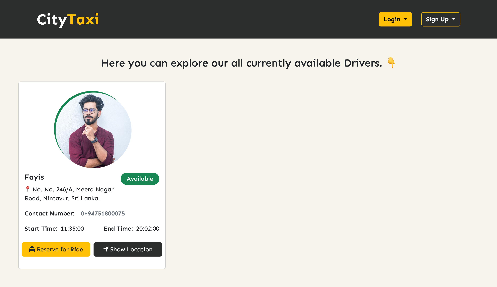
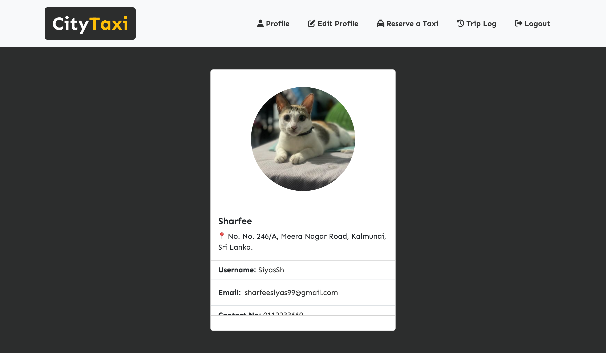
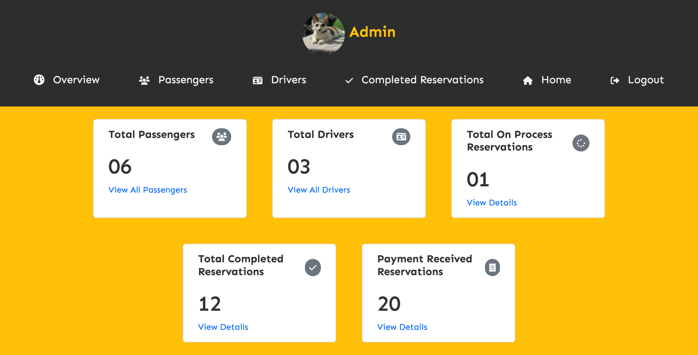
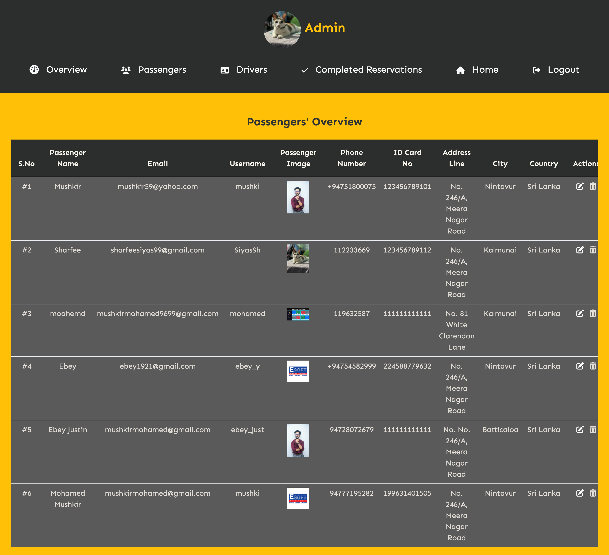
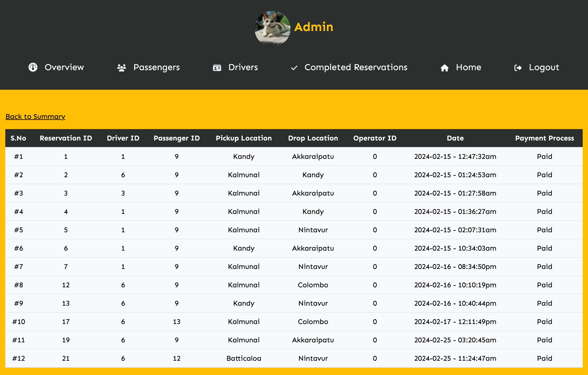
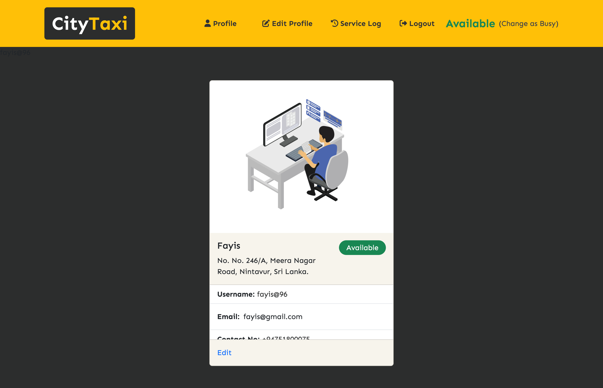
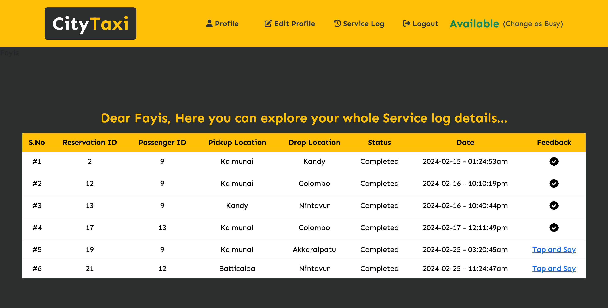

# Taxi-PI Web Application

The Taxi PI Reservation System is a web-based platform developed for Taxi PI (PVT) Ltd, tailored to the needs of low to mid-income range passengers in city areas across the island. This system offers a streamlined booking experience, focusing on performance, superior service, and quality. Passengers can easily reserve taxis through a user-friendly interface, specifying their pickup time and location. The system ensures efficient transportation, prioritizing safety and comfort. Taxi PI provides timely pick-up, private usage options, and dedicated customer care to enhance the booking process. Clean, well-maintained vehicles and courteous service uphold quality standards. Developed as a final year assessment for Software Engineering, the system utilizes HTML, vanilla CSS, Bootstrap, JavaScript, PHP, and MySQL for efficient development and deployment. Real-time tracking using Google Maps API allows passengers to monitor their taxi's location and ETA. The Taxi PI Reservation System aims to meet the expectations of its target audience, offering a reliable and high-quality service that sets it apart from competitors.

## Functions of the Project

- Admin, User Account creation.
- Admin can manage the process.
- After the account creation of user, Username & Password will be sent via Email.
- Location-based Services (Google API).
- Automatically distance calculation using From and To locations through API.
- Local Message sending method.
- Mobile Responsive design.
- Payment method through Stripe API.
- Status based driver filterization.
- Feedback providing implementation. (Passenger to Driver and Driver to Passenger)

## Technologies and Libraries Used and Learned

| S.No | Technologies and Libraries Used       |
| :--- | ------------------------------------- |
| 01   | [HTML]                                |
| 02   | [CSS3]                                |
| 03   | [Bootstrap]                           |
| 04   | [JavaScript]                          |
| 05   | [PHP]                                 |
| 06   | [MySQL]                               |
| 07   | [JustValidateDev] - (Data Validation) |
| 08   | [Google-Console]                      |
| :--- | ------------------------------------- |

## Screenshots

















## How to run

- Clone the Repo into Local machine

```

- Open the DB Folder

- Import the database file into phpmyadmin

- Run the server (XAMPP / WAMP)

- Copy the Project file into "htdocs" folder.

- Open the browser and type as `localhost/taxi-pi and enter
- Now you can explore the project.

### License: MIT (Do whatever, you want!)


